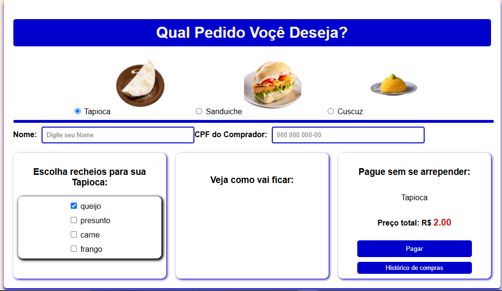

# Título: 
Sistema de Pedidos de Comida

# Sobre o projeto
# Descrição:

Projeto de sistema de pedidos de comida com opções de Tapioca, Sanduíche e Cuscuz. O usuário pode selecionar recheios, visualizar o pedido e calcular o preço total. Desenvolvido em HTML, CSS e JavaScript para praticar formulários interativos e manipulação de dados no front-end.

OBS: o projeto não está 100% ainda falta implementação do banco de dados como o pagamento para ser exibida no historico o valores selecionados.

## Desing do Projeto

Exemplo de Resultado:

# Funcionalidades:

Escolha do tipo de alimento (Tapioca, Sanduíche, Cuscuz)

Seleção de recheios com caixas de seleção

Campo para nome e CPF do comprador

Visualização do pedido e cálculo do preço total

Tecnologias utilizadas: HTML, CSS, JavaScript, kotlin
Banco de dados: PgAdmin, postgres

Como executar: Abra o arquivo index.html em um navegador.

Buildar ou Startar o projeto e testar no local host.
O local host e: http://localhost:8080/food?id=1